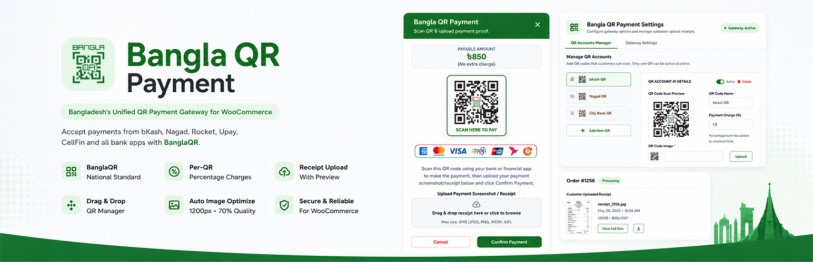
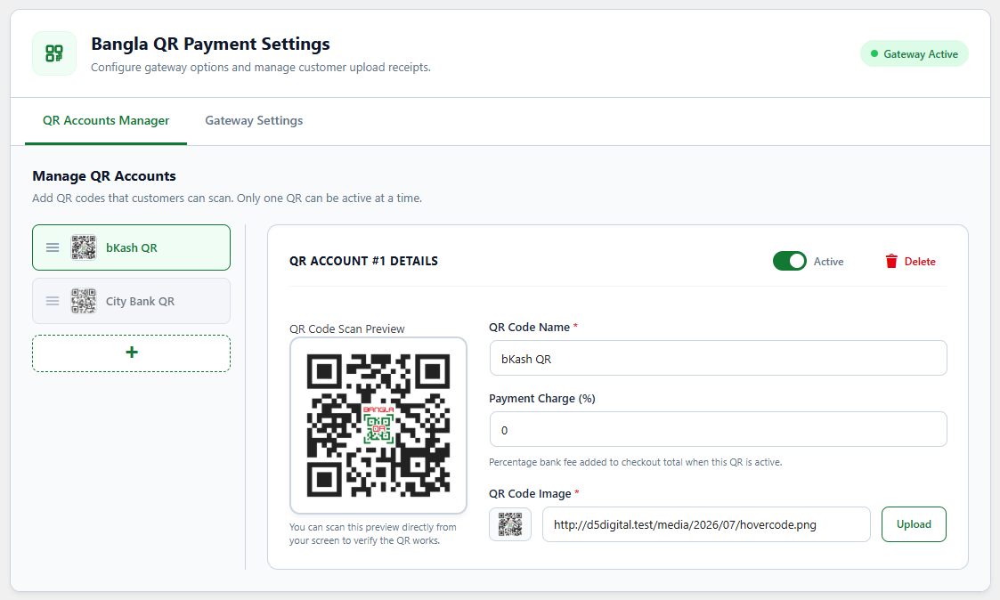
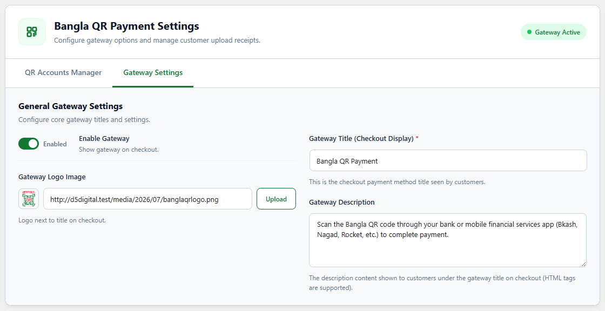
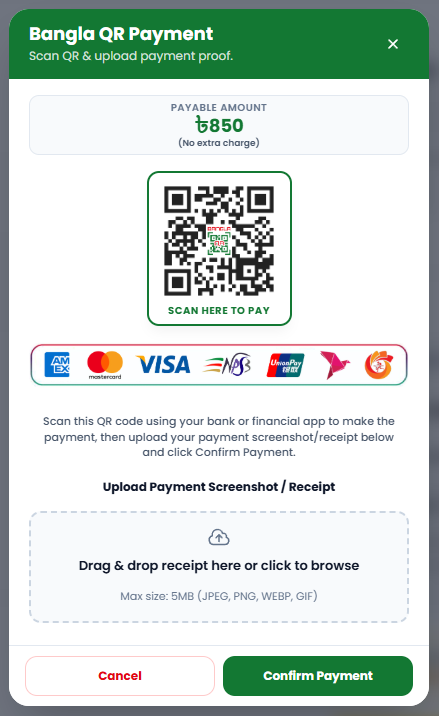
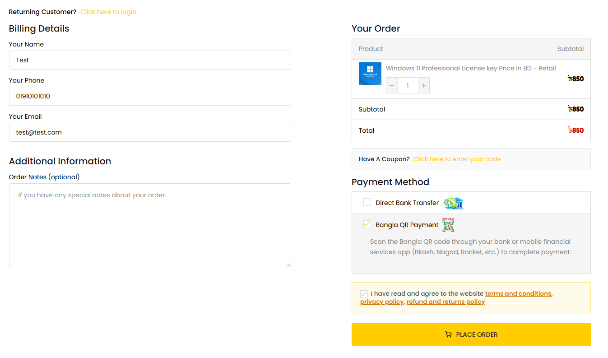
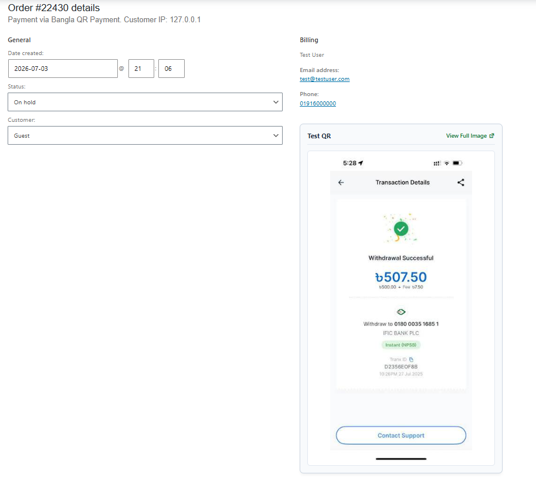

# 💳 SmartQR Payment Gateway for BanglaQR

A WooCommerce payment gateway supporting bank and mobile QR payments with a scan-to-pay popup and payment receipt upload verification. Aligned with Bangladesh's national QR payment standard, this plugin enables merchants to accept payments from any bank app or mobile financial services (MFS) including bKash, Nagad, Rocket, Upay, CellFin, and bank transfers.
---

## 📌 Plugin Information
- **Contributors:** shagor447  
- **Tags:** woocommerce, payment, gateway, banglaqr, qrpayment
- **Requires at least:** WordPress 5.6
- **Tested up to:** WordPress 7.0 
- **Requires PHP:** 7.4  
- **Stable tag:** 1.2.2 
- **License:** [GPLv2 or later](https://www.gnu.org/licenses/gpl-2.0.html)

---

## 📖 Description
SmartQR Payment Gateway for BanglaQR is a payment gateway for WooCommerce websites operating in Bangladesh. Built to support the unified **BanglaQR** national standard launched by Bangladesh Bank, this plugin enables merchants to accept payments from any bank app or mobile financial services (MFS) including **bKash, Nagad, Rocket, Upay, CellFin, and bank transfers**.

During checkout, customers receive a scan-to-pay QR popup modal. They can scan the QR code from their mobile apps, complete the payment, and upload their payment screenshot or receipt before checking out. 

Backend administrators can configure multiple QR codes, assign customized processing bank fees/percentage charges per QR, and check customer-uploaded payment receipts inside the WooCommerce order review screen.
---

## ✨ Features
- **BanglaQR Integration:** Aligned with Bangladesh's national QR payment standard.
- **MFS & Bank Apps Compatibility:** Works with bKash, Nagad, Rocket, Upay, CellFin, City Touch, and bank apps.
- **Popup Modal:** A responsive checkout popup that displays the payable amount, active QR, and instructions.
- **Per-QR Percentage Charges:** Define separate bank fees or processing charges (e.g., 1.5% for credit cards, 0.7% for bKash) dynamically calculated and added to the checkout total.
- **Proof of Payment Upload:** Customers can upload screenshots or receipts directly inside the checkout popup.
- **Automated Image Optimization:** Uploaded receipts are auto-rotated, scaled to 1200px, and compressed to 70% quality on-the-fly.
- **Drag-and-Drop QR Manager:** Sort and prioritize multiple QR accounts using a sortable settings panel.
- **Settings Access Shortcut:** Quick "Settings" shortcut link on the WordPress plugin lists page.
- **Attachment Preview:** Preview and verify uploaded receipt slips inside the order details page.

---

## ⚙️ Installation
- Upload the `smartqr-payment-gateway-banglaqr` folder to the `/wp-content/plugins/` directory.
- Activate the plugin through the 'Plugins' menu in WordPress.
- Go to WooCommerce -> Settings -> Payments -> Bangla QR Payment.
- Configure your QR accounts and details.

---

## ❓ Frequently Asked Questions

### 🔹 Do I need a BanglaQR?
Yes. You can generate and use your official BanglaQR code (or any bank/MFS QR code) inside the QR accounts manager.

### 🔹 Can I charge extra fees for payment methods?
Yes. You can define a customized percentage charge (e.g., 1.85% for bKash, 0% for Bank transfers) inside each QR account settings. The plugin dynamically calculates the charge based on the cart total and updates the payment details in real time.

### 🔹 Where do I verify the customer-uploaded screenshots?
Shop administrators can view and download the uploaded receipt proofs directly under the "Order Details" panel in the WooCommerce -> Orders page in the WordPress admin panel.

### 🔹 Does it support guest checkout?
Yes, guest customers can checkout and upload their payment screenshots securely.

---

## 🖼️ Screenshots
1. QR Accounts Manager. 
2. Gateway Settings. 
3. Checkout payment popup. 
4. Checkout page payment method. 
5. Customer payment receipt/screenshot. 

---

## 📝 Changelog

### 1.2.2
- Minor updates and compatibility checks.

### 1.2.1
- Initial public release of SmartQR Payment Gateway for BanglaQR.
- Added support for Bangladesh Bank's unified BanglaQR standard.
- Added QR payment popup with payment proof upload.
- Added multiple QR account management with sortable interface.
- Added per-QR processing fee configuration.
- Added automatic receipt image optimization and compression.
- Added receipt preview in WooCommerce order details.
- Added settings shortcut link from the Plugins page.

---

## 📢 Update Notice
= 1.2.2 =
Upgrade to version 1.2.2 for performance improvements and compatibility checks.

## ⚖️ License & Copyright
- Copyright © **Raisul Islam Shagor** 
- Email: deploy@raisul.dev
- Website: https://raisul.dev/
- Contact: https://raisul.dev/contact
- Licensed under the **GPLv2 or later**  
- ✅ This plugin is **free to use, modify, and distribute** under the license terms.
